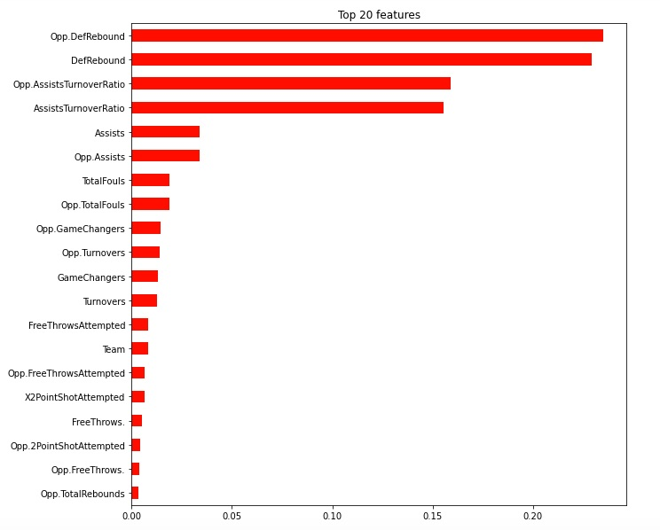

## Las Vegas vs the World

  In the world of Sports Gambling there is a phrase that bettors commonly use: “Vegas always knows”. This phrase developed from Las Vegas Sportsbook Oddsmakers frequently guessing the winner of games, as well as how much the winning team wins by to prefection. In 2018, Las Vegas Sportsbooks profitted 300 million dollars off public bets. 300 million dollars from being able to more accurately guess the outcome of sporting events. Imagine a life where you could just watch sports all day and make that amount of money. How do Oddsmakers seemingly always predict the outcomes of games. Luck? No. Rigged Games? No (but maybe sometimes, see previous blog post). They do it by using data, statistics, and predictive modeling. Below I will sample for you just how Las Vegas does this; I will demonstrate it with a dataset from Kaggle.com that has the winner of every NBA game from 2014-2018.

## The Data
Below is a graphic of what the dataset looks like. As you can see, it has many different features such as "Steals, Turnovers, Rebounds, Shot Attempts, ect..". I removed a few features such as "total points, opponent total points, field goal %, ect.." as these are all features that would already be able to tell our model who won the game. We dont want, we want to predict the winner without already knowing. For comparission later on, we have baseline accuracy of 50.00%, which just means if you were to guess, you would be able to guess accurate 50.00% of the time.

## Feature Engineering for More Accurate Predictions
  Once I took care of the leakage issue, I began to analyze the data to see if I could engineer any new features to help better train my model. From my initial evaulation of the data I noticed immediately that the team statistics that were apart of this dataset were very general. Rebounds, steals, blocks, essentially all the basic statistics you would expect in a basketball game. In order to try to beat Vegas Oddsmakers, I knew that I would have to craft different things for my predicitive model to learn from. 
  I decided to start crafting features that I considered High % Features. For instance, I discoverd that the majority of games have Home Team Total Rebounds under 60 and I know from playing basketball that if you team shots 80% from the Free Throw line, then that is a High % of makes and betters your odds of winning the game. I also did this for fouls because as your team accumalates more fouls, the coach has to change strategy mid-game to make sure players don't foul out. I also created an Assist/Turnover Ratio, assists tell us your team is moving the ball well and making smart plays (so we expect more points), turnovers mean you are being irresponsible with your offensive possessions (when you dont have the ball, you cant score). 
  My last two engineered features were 'Game Changers' and 'East' or 'West' opponent. 'Game Changers' is a feature in which I added together a teams total blocks and steals. In basketball, blocking someone's shot is incredibly demorilizing to the opponent. Sports arent just physical, they are mental, very mental, anytime you can get in someones head and force their focus elsewhere is a win in my mind. When you block someones shot, the whole arena goes crazy and all of sudden that mental factor becomes active. Same with steals, you steal a ball from someone dribbling, it is embarassing and aggrevating as an opponent. Since I couldnt engineer a feature that evaluated mental barriers in games, I felt this would be the closest I could get to making that factor apparent. Lastly, I made a column for all Eastern Conference Teams and Western Conference Teams. I did this because as a basketball fan through the 2014-2018 season, it doesnt take a genius to figure out the Western Conference has substantially better teams, and higher caliber individual players. I believed this might impact the chances of winning or losing a game depending on what conference the team is playing.

## The Model's Results
  After taking all of provided features and newly engineered features, my model was able to predict the winner of every basketball game between 2014-2018 with 86.1% accuracy. Seeing as the best sports bettors in the world have a hard time surpassing a 60% win rate, I am very content wth this. Now to be fair, the best sport bettors in the world are not just picking who wins or loses a game. They bet on point spread, over/under point totals in the game, half time winner, 1st quarter winner, ect. With that said, having a model that can tell you who will win the game 86% of the time is a great starting point for a professional sports gambler to begin to approach how they will bet on certain things. If the gambler know one team should win the game according to this model, they might make another bet saying "they should win the 1st quarter, if they win the game". Gambling is complex.
  In case you are curious, the reason that people dont just pick winners and losers all the time in sports gambling is because Las Vegas Oddsmakers make you bet a lot more money to win your bet on teams that they think will win the game. In the Lakers vs High School example earlier the lakers would be like '-100,000', which means you have to bet 100,000 dollars to win 100. Just a word of caution to those curious new gamblers out there.
  

## What Did and Didn't Surprised Me?
  After I ran my model and got my validation accuracy of 86.1%, I was curious to see which features were most helpful in making predictions. The bar graph below confirmed one of my initial thoughts about the feature 'Assist/Turnover Ratio'. When you move the ball well on offense, and limit the amount of times you accidently lose the ball to the other team, your chances of winning go up. This is also true for the most predictive feature "rebounds", anytime you are on defense and a team shoots and misses, collecting a rebound prevents them from scoring again. The more rebounds you have says a few things "the other team is missing shots often, and they are not getting a second chance opportunity to score". Lastly, the Game Changers feature was a good choice, blocks and steals cause issues. Whether those issues are results of mental barriers that I believe arise from blocks and steals, I can't officially say, but its a good to see my thought process was correct.
  What did surpise me was that the East and West opponents columns did nothing to my models predicitive power. I was a very very firm believer that playing Western Conference opponents would impact my model greatly, but now that I see the outcome, I'm glad it didnt and here is why. As gamblers we tend to get to caught up in what we visibily see happening. We visibilly see Western Conference opponents scoring so many points its unbelievable at times, and now I realize that in a sense it is unbelievable. The Western Conference might have teams scoring many points, but the tradeoff is defense. They give up a lot of points to becasue they play lazy defense. It is awesome to see the model picking up on that and helping me stray away from "the eye test"

  
#
  

## Final Thoughts
It should be clear after reading this data that Referees have a much larger impact on the game than most may believe. The simply action of calling an extra foul on an oppossing team can be a deciding factor in the outcome of the game. With nationwide legalized gambling getting ready to launch these upcoming seasons, its more important that ever to protect the integrity of officiating in the NBA, and make light of situations we as viewers deem to be 'strange' or 'off'
