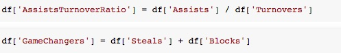

## Las Vegas vs the World

  In the world of Sports Gambling there is a phrase that bettors commonly use: “Vegas always knows”. This phrase developed from Las Vegas Sportsbook Oddsmakers frequently guessing the winner of games, as well as how much the winning team wins by to prefection. In 2018, Las Vegas Sportsbooks profitted 300 million dollars off public bets. 300 million dollars from being able to more accurately guess the outcome of sporting events. Imagine a life where you could just watch sports all day and make that amount of money. How do Oddsmakers seemingly always predict the outcomes of games. Luck? No. Rigged Games? No (but maybe sometimes, see previous blog post). They do it by using data, statistics, and predictive modeling. Below I will sample for you just how Las Vegas does this; I will demonstrate it with a dataset from Kaggle.com that shows if the Home Team Won or Lost for every NBA game from 2014-2018.

## The Data
Below is a graphic of what the dataset looks like. As you can see, it has many different features such as "Steals, Turnovers, Rebounds, Shot Attempts, ect..". I removed a few features such as "total points, opponent total points, field goal %, ect.." as these are all features that would already be able to tell our model who won the game. We dont want, we want to predict the winner without already knowing. For comparission later on, we have baseline accuracy of 50.00%, which just means if you were to guess, you would be able to guess accurate 50.00% of the time.

## How Oddsmakers Make Predictive Models Better
  Oddsmakers are presented the same data that anyone watching basketball can obtain, in fact literally anyone in the world can go grab this data set I used and try to make a predictive model. Oddsmakers are smart though, they know you have access to this information, so they engineer new features into their datasets. They take existing data and make new data with it. Let me demonstrate, the graphic below now has new columns I created, two of which are called "Assist/Turnover Ratio" and "Game Changers". From watching and playing basketball I already knew that Assists are a sign your team is playing fluidly together, and turnovers mean you are not playing well together. I thought making a ratio for the Good:Bad would give my model additional predictive power, power it did not have before. The Game Changers column is a combination of Blocked Shots and Steals. I call these game changers because in an arena, when a team playing defense blocks a shot or steals a pass it gives life and noise from the crowd. A noisey crowd makes for a difficult playing envirnoment, hence Game Changer. I used my knowledge of basketball in conjuction with data to make a more accurate prediction on the outcome of the game. Additional features were added, but for the sake of your time, I wanted to limit discuss to these two.
 

## Two Models, Two Outcomes
  Now to the good stuff. I took the majority of the original data and my newly engineered features, and placed them into two different types of Logistic Regression models. I choose two differnt types to see if one method was better than the other for this case. For these models, I split my data into a training, validation, and testing set. I trained my model on games before 2016, validation then predicted games between 2016-2017, and testing predicted the 2018 season. One model achieved a validation score of 85.7%, while the other achieved a validation score of 86.1%. Very happy with both, as both these scores predicted the winner of games at a very high rate. Seeing as most professional sports gamblers end a season with around 60% of bets guessed correctly, I will gladly take these score. In the next section, lets look at what features were most predictive.
  

## What Features Were Most Predictive?
  The image below shows a bar graph of the most predictive features in my model. The top 4 features were not provided for use in the original data. Defensive Rebounds, Opponents Defensive Rebounds, AssistTurnover Ratio, and Opponent AssistTurnover Ratio were all enginereed by me. This is why having previous knowledge about what you are trying to predict is important. I know that defensive rebounds were important to add because defensive rebounds prevent the other team a second chance at scoring a basket. I know assist and turnovers are very telling of how a team is executing their offense. Are they passing the ball aimlessly or with purpose, that ratio helps to determine that factor. Anyone (with time) can make a predictive model, but the more you understand about a subject before diving into the data, the more predictive you can make your model. 

  
## Now Lets Explore
  Now that we know which features in our model were predicting the outcome with the most power, lets dive a little deeper. From the features above, I created a few different types of plots that compare variables, and show how the two together impact a teams probability winning or not winning. First, lets look at 'OpponentsDefRebounds' and 'OpponentsAssistTurnoverRatio' since these were two of our most 'telling' features. Notice how when OpponentsAssitTurnoverRatio goes all the way up, and OpponentsDefRebounds go all the way up, the probablity of the home team winning that game is 11.00%. This makes perfect sense because these two statistics show how well a team is controlling the basketball. Controlling the ball and not giving up extra shots will help you win game
  

## Final Thoughts
It should be clear after reading this data that Referees have a much larger impact on the game than most may believe. The simply action of calling an extra foul on an oppossing team can be a deciding factor in the outcome of the game. With nationwide legalized gambling getting ready to launch these upcoming seasons, its more important that ever to protect the integrity of officiating in the NBA, and make light of situations we as viewers deem to be 'strange' or 'off'
